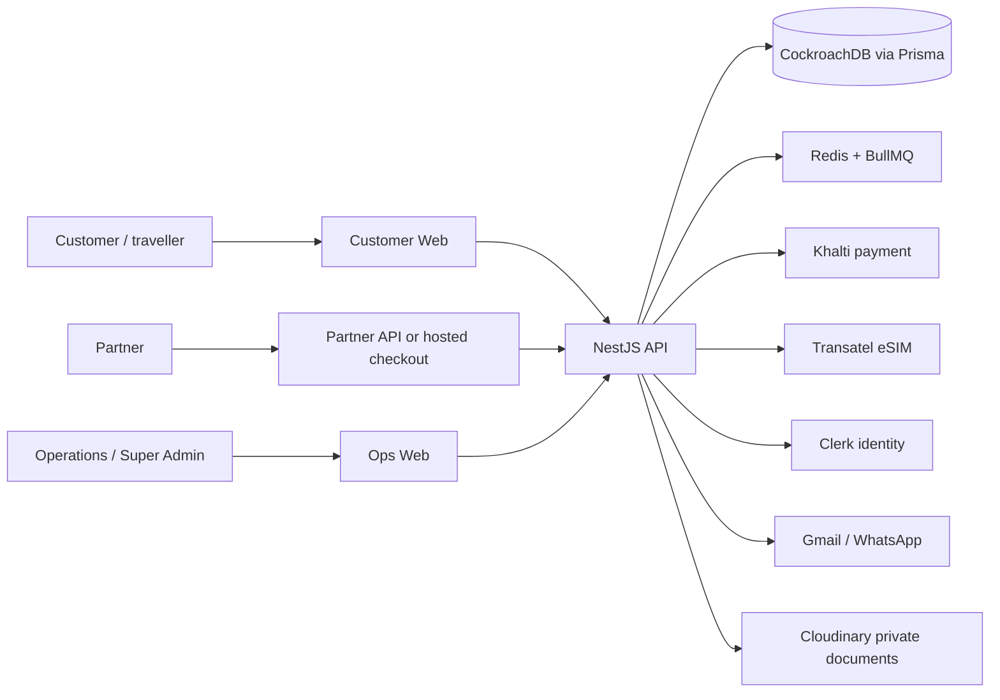
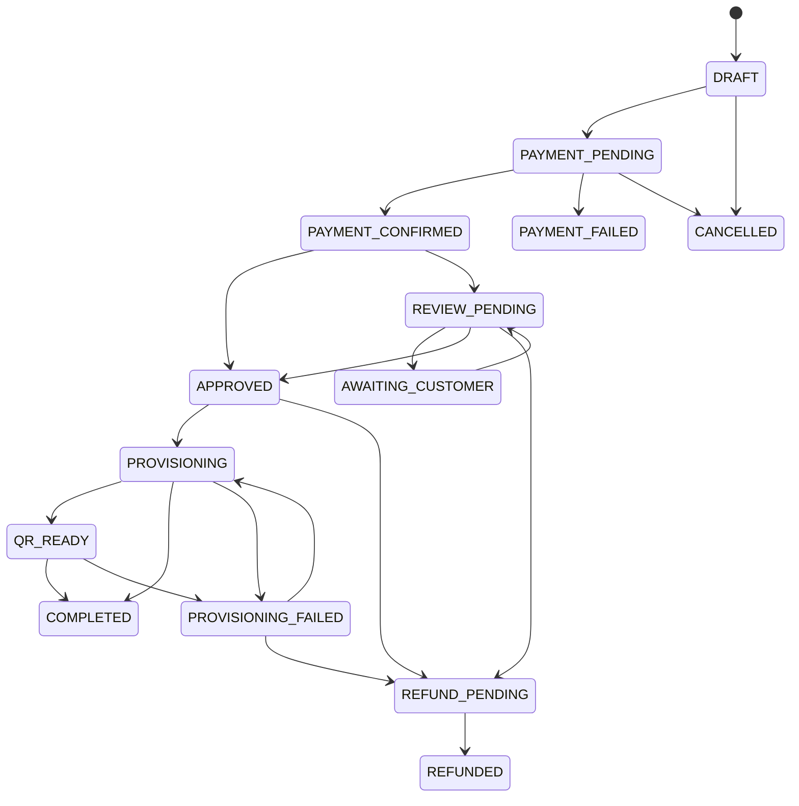

# Visa Compass System and Operating Guide

**Purpose:** product overview, business-process guide and technical reference  
**Verified against the implementation:** 2026-08-13

## 1. What Visa Compass does

Visa Compass is a travel eSIM platform. It helps a traveller buy a data plan for a destination, complete the required identity and travel-document steps, pay, receive a digital eSIM activation package, install it and monitor its usage.

The platform also gives Operations staff the tools to manage plans, stock, orders, payments, documents, provider events and customer support cases. Approved commercial partners can sell the same eSIMs through an API or a Visa Compass hosted checkout link.

At a high level, this is how the product works:

The API is the central decision point. It validates requests, applies business rules, controls access, records changes and connects the web applications to the external providers. CockroachDB is the durable business record when `PERSISTENCE_MODE=prisma`. Redis/BullMQ runs work that should not keep a customer waiting, such as provisioning, notifications and callback processing.

## 2. Main parts of the system

| Component | What it is | Why it is needed | What relies on it |
| --- | --- | --- | --- |
| Customer Web (Next.js) | The customer-facing website. | Lets travellers browse, checkout, view orders/eSIMs and notification history. | Customers and the API. |
| Hosted checkout | A token-based partner traveller/document flow. | Lets a partner use Visa Compass pages instead of building its own checkout. | Checkout-link partners and travellers. |
| Ops Web (Next.js) | Internal Operations/Admin website. | Lets staff investigate and resolve operational work. | Operations and Super Admin users. |
| API (NestJS) | Backend service. | Enforces validation, RBAC, lifecycle changes, integrations and response redaction. | Every portal and integration. |
| CockroachDB / Prisma | Primary business database. | Holds users, plans, orders, payments, documents, eSIM stock, subscriptions, events and audit records. | Every durable business process. |
| Khalti | Customer payment gateway. | Starts and verifies direct customer payments. | Customer checkout. |
| Transatel | Connectivity/eSIM provider. | Supplies catalogue, provisioning, lifecycle and usage information. | eSIM fulfilment. |
| Clerk | Identity provider. | Handles customer/staff sign-in and identity synchronisation. Database roles still decide permissions. | Sign-in and staff access. |
| Cloudinary | Private document storage. | Supports signed uploads and controlled document reads. | Checkout and document review. |
| Gmail / WhatsApp | Notification channels. | Delivers order updates. QR-ready email attaches a PNG QR image. | Customers and support. |
| Redis / BullMQ | Background-job and shared rate-limit infrastructure. | Makes delayed work reliable across instances. | Provisioning, callbacks, notifications, reconciliation and webhooks. |

## 3. Users and roles

| Role | What they can see | What they can do | Main restrictions |
| --- | --- | --- | --- |
| Visitor | Public plans and coverage. | Start checkout; sign in/up. | Cannot see orders or sensitive data. |
| Customer | Their own orders, eSIMs, documents, timelines and notifications. | Provide traveller details/documents, pay, verify passport, cancel an eligible order, abandon payment, refresh usage, download/resend QR. | Cannot view another customer or Ops data. |
| Operations | Operational orders, customers, stock, logs, events and notifications. | Review documents, request reupload, approve/retry/cancel orders, fail/refund payments, refresh usage, manage inventory, replay events, reconcile provisioning, suspend/terminate eSIMs. | Cannot manage Super Admin security/identity configuration. |
| Super Admin | All Operations and Admin areas. | All Operations actions plus plans, staff, integrations, partners, credentials, partner balances/webhooks/refunds and test notifications. | MFA is required when enabled. |
| Partner API credential | Only that partner's commercial records. | Depends on assigned scopes: catalogue, order, eSIM, usage, account, ledger, checkout and refunds. | Cannot use internal/Ops APIs or read another partner's records. |

Clerk proves who has signed in. The database is the authority for `CUSTOMER`, `OPERATIONS` and `SUPER_ADMIN` access. A Clerk profile or metadata alone does not grant an API role.

## 4. How a customer buys and uses an eSIM

1. **Browse and choose.** Customer Web calls public catalogue and coverage APIs. Only active countries and plans are available.
2. **Check compatibility.** The customer chooses a plan and accepts the eSIM compatibility requirement before checkout continues.
3. **Create the order.** The customer starts in `DRAFT` and submits validated traveller details.
4. **Provide documents.** Passport and ticket are required. VISA is required only where destination configuration says so. Uploads are private and verified. Passport verification compares document/OCR details with the traveller details.
5. **Make payment.** The customer starts a Khalti payment. The order becomes `PAYMENT_PENDING` until Visa Compass confirms the gateway result.
6. **Approve and provision.** A verified direct payment moves forward automatically. Replacement-document cases may wait for Operations review. The system reserves inventory and asks Transatel to prepare the eSIM in the background.
7. **Receive the eSIM.** Once QR activation data exists, the order reaches `QR_READY`. Visa Compass emails the traveller a QR image attachment. An authenticated customer can also download the protected QR image through the API.
8. **Install, activate and use.** When Transatel confirms activation, the order becomes `COMPLETED`. The customer can refresh/view usage. Provider expiry, suspension or termination updates subscription and inventory lifecycle.

The customer should not be told an eSIM is ready until it is `QR_READY`. A paid order can legitimately remain in `PROVISIONING` while provider work completes.

## 5. Order and payment lifecycle

| Order status | Business meaning | What normally happens next |
| --- | --- | --- |
| `DRAFT` | Checkout started but not ready for payment. | Customer provides missing requirements or cancels. |
| `PAYMENT_PENDING` | Gateway handoff started; payment is not verified. | Callback/browser verification/reconciliation, or abandonment/expiry. |
| `PAYMENT_CONFIRMED` | Gateway result matched the order, amount and reference. | Direct order auto-approves or moves to review path. |
| `REVIEW_PENDING` | A human review is needed. | Ops approves, requests a replacement document, or handles refund path. |
| `AWAITING_CUSTOMER` | Customer needs to provide a replacement document/data. | Customer reuploads; order returns to review. |
| `APPROVED` | Order can reserve inventory and start provider work. | Provisioning is queued. |
| `PROVISIONING` | eSIM/inventory/provider work is underway. | QR becomes ready, activation completes, or failure is recorded. |
| `QR_READY` | Activation package exists. | Email/download QR; wait for provider activation. |
| `COMPLETED` | Provider confirmed activation. | Usage and lifecycle monitoring continue. |
| `PAYMENT_FAILED` / `CANCELLED` | Payment did not complete or the order stopped. | No fulfilment; inspect before starting a new transaction. |
| `PROVISIONING_FAILED` | Provisioning attempts failed or an error was recorded. | Ops investigates, reconciles/retries or follows refund process. |
| `REFUND_PENDING` / `REFUNDED` | Refund awaits or has received handling. | Finance/Ops reconciliation. |

Payment records use `INITIATED`, `PENDING`, `COMPLETED`, `FAILED`, `CANCELLED` and `REFUNDED`. Khalti payment confirmation is accepted only when provider lookup matches the order, amount, reference and status. Duplicate callbacks are deduplicated. A timeout or unknown response does not automatically become a successful payment.

**[REQUIRES BUSINESS CONFIRMATION]** The code does not define the evidence, approval level or segregation-of-duties rule for a human to force-confirm a payment or resolve an ambiguous gateway refund.

## 6. eSIM, inventory and subscription lifecycle

eSIM stock records move through `IMPORTED → AVAILABLE → RESERVED → ASSIGNED → ACTIVATED`. A profile can instead become `EXPIRED`, `TERMINATED` or `QUARANTINED`. A customer eSIM links the stock profile to the customer/order, and can hold provider subscriptions in `PENDING`, `ACTIVE`, `SUSPENDED`, `EXPIRED`, `TERMINATED` or `FAILED`.

The system stores a `ProvisioningOperation` so it can recover a delayed provider request safely. Its states are `CREATED`, `SUBMITTING`, `ACCEPTED`, `WAITING_FOR_QR`, `QR_READY`, `ACTIVATED`, `RECONCILE_REQUIRED`, `REJECTED`, `MANUAL_REVIEW` and `CANCELLED`. This allows Operations to check the provider before retrying instead of accidentally sending a second preload request.

Operations can suspend and terminate a Transatel subscription. **[PARTIALLY IMPLEMENTED]** Ops does not yet expose provider reactivation/unsuspend. That is a Phase 2 item.

## 7. Operations guide — what staff can do today

| Area | Why Ops uses it | Typical action | Result / common issue |
| --- | --- | --- | --- |
| Dashboard and orders | Find work needing attention. | Search/filter orders and open timeline/details. | Shows review, pending, QR-ready and failed work. |
| Document review | Check required travel documents. | Open the secure preview; approve or request reupload with a reason. | Records review/audit entry. Reupload moves order to `AWAITING_CUSTOMER`. |
| Order recovery | Move eligible orders forward or stop them. | Approve review, retry `PROVISIONING_FAILED`, cancel, mark payment failed, request refund. | State-transition rules block invalid moves. |
| Provisioning recovery | Resolve a delayed/uncertain provider result. | Open Provisioning recovery and reconcile the operation. | Queries provider data without submitting a second preload. |
| Webhook recovery | Recover an event that did not process. | Inspect integration event then replay a dead-letter payment/Transatel event. | Requeues the stored event; only supported sources can be replayed. |
| Inventory | Keep enough usable eSIM profiles. | Import JSON/CSV, approve/reject batches, reconcile a profile, refresh usage. | Updates profile/provider state. |
| Customers | Help a traveller without searching raw database records. | Search aggregate profile and order history. | Brings customer/order history together. |
| Notifications | Investigate failed or missing messages. | Review status, send Super Admin test, retry an eligible notification. | Recipient comes from stored traveller contact. |
| Integration/logs | Diagnose provider/configuration issues. | Test/sync integration and inspect `IntegrationLog`. | Shows outbound call status, duration and safe error information. |
| Admin | Maintain system configuration. | Manage plans/CSV, staff, partners, credentials, price lists, balances, webhooks and partner refunds. | Sensitive actions require Super Admin. |
| Transatel lifecycle | Control active service. | Suspend or terminate an eSIM with a reason. | Saves durable operation/audit record and provider response. |

Potential capabilities that have not been approved requirements: reactivation, controlled contact correction, payment-exception case management, gateway-refund reconciliation and agreed finance approval controls.

## 8. What happens when something goes wrong

| Situation | What the customer sees | What the system does | What Ops should do |
| --- | --- | --- | --- |
| Payment succeeded but provisioning fails | Payment/order timeline without QR; possible provisioning failure. | Keeps payment confirmed; stores attempts, operation and provider logs. | Inspect attempts/logs, reconcile/retry, then follow refund policy if unresolved. |
| Payment is pending or unknown | Pending payment. | Browser verification, callback and reconciliation check gateway result. | Check payment/reference. Do not force-paid without agreed policy. |
| Provider times out/unavailable | In-progress state or safe error. | Stores typed provider failure, retries/backoff and integration log. | Check provider configuration/logs; reconcile then retry eligible order. |
| QR is delayed | No QR yet. | Uses `WAITING_FOR_QR` and a reconcile schedule. | Reconcile operation; never create a duplicate preload. |
| Webhook is missing | State can remain delayed. | Polling/reconciliation is a backstop. | Inspect `IntegrationLog`; reconcile/verify. |
| Webhook is duplicated | No duplicate customer action. | Stores unique `(source,eventId)` then processes idempotently. | Inspect event only if needed. |
| Duplicate payment/order request | Customer should not get a duplicate order. | Uses idempotency and provider-reference checks. | Query the existing transaction and use correlation ID. |
| Activation fails | QR-ready but not completed, or provider lifecycle updates. | Applies provider callback/lifecycle event. | Inspect Transatel event/log and support traveller. |
| eSIM inventory is unavailable | Order cannot be fulfilled. | Atomic reservation fails and records an error. | Import/approve/reconcile stock; avoid overselling. |
| Traveller/document information is invalid | Validation or reupload request. | Rejects invalid input/upload or moves order to customer action. | Review document and give a clear reupload reason. |
| Refund/cancellation is requested | State depends on current order stage. | Applies allowed transition/audit; approved partner refunds credit ledger. | Follow finance process. Full gateway-refund reconciliation is Phase 2. |

## 9. Important business records

| Record | Plain-language purpose | Relationships and source of truth |
| --- | --- | --- |
| `User`, `Role`, `UserRole`, `Customer` | Who uses the platform. | Clerk-linked identity; database account type/roles control permissions. Customer owns orders/eSIMs/consents. |
| `Country`, `Plan` | What can be sold and where. | Public catalogue only includes active country/plan entries. |
| `Order`, `OrderEvent`, `OrderReview` | The purchase and its history. | Order is the core lifecycle record. Events show every state change; reviews show staff decisions. |
| `Traveler`, `Document`, `CustomerConsent` | Private traveller information, document evidence and consent. | Sensitive fields are encrypted/hashed; document status controls checkout/review. |
| `Payment` | Gateway payment attempt and verification. | Stores provider/reference/status/amount and verification attempts. |
| `EsimInventory`, `InventoryBatch`, `CustomerEsim`, `Subscription` | The physical/provider-side digital SIM stock and service. | Connects stock, customer/order assignment and provider lifecycle/usage. |
| `ProvisioningAttempt`, `ProvisioningOperation` | Evidence and recovery state for provider work. | Stores request/response/error snapshots and safe retry/reconciliation state. |
| `WebhookEvent`, `IntegrationLog`, `Notification`, `AuditLog` | Operational evidence. | Shows inbound callbacks, outbound provider calls, messages and human/admin changes. |
| Partner records | Partner commercial operation. | Covers partner/credential, customer mapping, price list, account/ledger, hosted session, refunds, webhooks/events and idempotency. |

## 10. APIs and external systems

The API prefix is `/api/v1`. Requests go through validation, correlation, logging, rate limiting and error handling. Customer/Ops APIs use Clerk identity plus database-authoritative RBAC. Partner APIs use scoped bearer credentials and partner ownership checks.

Inbound external events are protected as follows:

| Source | Verification |
| --- | --- |
| Clerk | Svix verification. |
| Khalti | `x-visa-signature`. |
| Transatel | `x-tsl-signature-256`; required in production. |

The API preserves raw request bytes for signature verification. It stores and deduplicates callbacks before a queue processes them. Outbound partner webhooks use HMAC-SHA256 over timestamp/body, a 10-second timeout and up to three attempts.

BullMQ queues are `provisioning`, `provider-callbacks`, `payments`, `notifications`, `reconciliation` and partner webhooks. Jobs use three attempts and exponential backoff with a two-second base. Running without Redis is an in-process local simulator/fallback; it is not appropriate for high-volume, multi-replica production.

## 11. Security and privacy

- Helmet, configured CORS, body-size limits and `no-store, private` headers protect HTTP traffic and sensitive responses.
- AES-256-GCM encrypts sensitive traveller and QR data. A separate HMAC key supports blind indexes. Production startup requires the encryption configuration.
- Cloudinary document uploads/reads are private and signed. The server verifies file type and size.
- Rate limits apply per IP/route. With Redis, the limit is shared. Webhooks are exempt because they are signature verified.
- `TRUST_PROXY` must match the real proxy arrangement. A wrong setting can make client-IP rate limits unreliable.
- API responses hide internal provider detail. Logs retain safe diagnostic detail with a correlation ID.

## 12. Monitoring and day-to-day operations

`/health/live` tells a platform monitor that the API process is running. `/health/ready` checks database and Redis, and returns 503 when a configured dependency is down. `MetricsService`, JSON logs, correlation IDs, `IntegrationLog`, `WebhookEvent`, provisioning records, notifications and audit logs are the main operational evidence trail. `OPS_ALERT_EMAIL` is available as configuration.

**[PARTIALLY IMPLEMENTED]** The repository supports observability, but source code cannot prove that an alert destination, uptime monitor, dashboard, log-retention policy, backup/restore drill or WAF is deployed. These must be completed and tested during production rollout.

## 13. Environments and configuration

Local development can use simulator modes. Production needs `NODE_ENV=production`, CockroachDB, Redis, encryption/hashing keys, Clerk production keys/webhook secret, Khalti keys/webhook secret, Transatel OAuth/callback secret, Cloudinary and live notification credentials. Main URLs are `API_PUBLIC_URL`, `CUSTOMER_WEB_URL`, `OPS_WEB_URL` and `NEXT_PUBLIC_API_URL`.

The production template requires `ORDER_WORKFLOW_MODE=single-instance` until the order workflow is redesigned around database-backed state/distributed locks. **[REQUIRES BUSINESS CONFIRMATION]** UAT/production domain names, replica count, provider certification status and deployment platform are not defined in source code.

## 14. Rules confirmed by the code

- Only active catalogue entries can be sold. The sale amount is captured in the order/partner pricing snapshot.
- Partner complete orders require compatibility, terms and privacy consent. Direct checkout requires compatibility acceptance before progress.
- Passport and ticket are required. VISA requirement comes from destination configuration.
- Direct payment requires passport verification where the flow calls it. Sensitive information must not go into metadata or logs.
- Khalti is the only payment provider. Only a verified matching result confirms payment.
- QR data is delivered once available. Email uses a QR image attachment, not a PDF. An authenticated customer can download the protected QR image.
- Partner accounts use prepaid NPR paisa. Optimistic locking protects balance changes and partner IDs isolate records.
- Inventory reservation is atomic. Provider events decide the provider lifecycle state.

## 15. Gaps, risks and next priorities

### Critical production rollout work

- Apply committed database migrations and generate Prisma client in deployment.
- Configure and test Clerk, Khalti and Transatel webhook secrets/callback URLs.
- Run Redis/BullMQ workers; test database backups/restores, health checks, monitoring/alerts, WAF/rate limits and real payment/provider callback journeys.

### High-priority product gaps

- Operations can suspend/terminate but cannot reactivate/unsuspend an eSIM.
- Manual payment confirmation and refund-reconciliation rules/workflow need business approval.
- The business rule for manual review versus automatic approval after verified payment needs to be agreed and documented.

### Medium-priority gaps

- Partner event-type catalogue and external UAT URL are not a stable published contract.
- QR-ready and delayed-provisioning messages need real live-delivery testing.
- Two existing Clerk test expectations disagree with the safer disabled-account behaviour and should be corrected.

### Lower-priority improvements

- Publish an SLA/timeout contract, decide IP allowlisting, design contact-change workflow and produce an external observability runbook.

## 16. Glossary

| Term | Meaning |
| --- | --- |
| eSIM | A digital SIM profile installed on a compatible device without a physical SIM card. |
| ICCID | The serial number of an eSIM profile. |
| QR / activation code | Sensitive data a device uses to download and install the eSIM. |
| Provisioning | Reserving/preparing the eSIM and asking the provider for activation data. |
| Subscription | The provider-side data-service record linked to an eSIM. |
| Webhook | An automatic HTTP message sent when an event happens. |
| Idempotency key | A key that lets a server recognise a retried mutation and avoid creating it twice. |
| Correlation ID | A trace identifier for one request across logs and support. |
| Prepaid partner account | A partner balance debited for partner-created orders. |
| Reconciliation | Checking a provider/database to recover a delayed or uncertain result. |
| Operations (Ops) | Staff who resolve customer, payment, stock and provider exceptions. |
